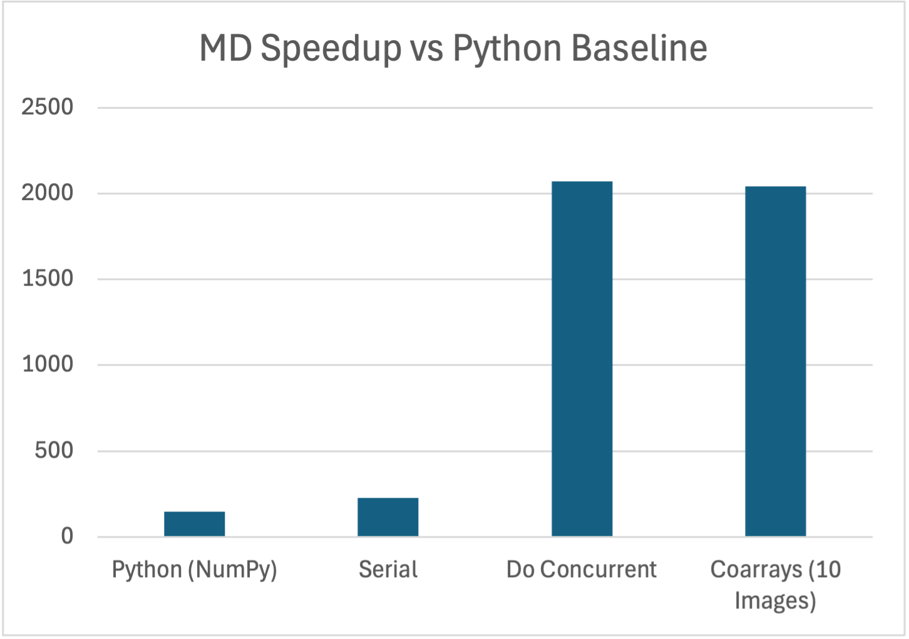
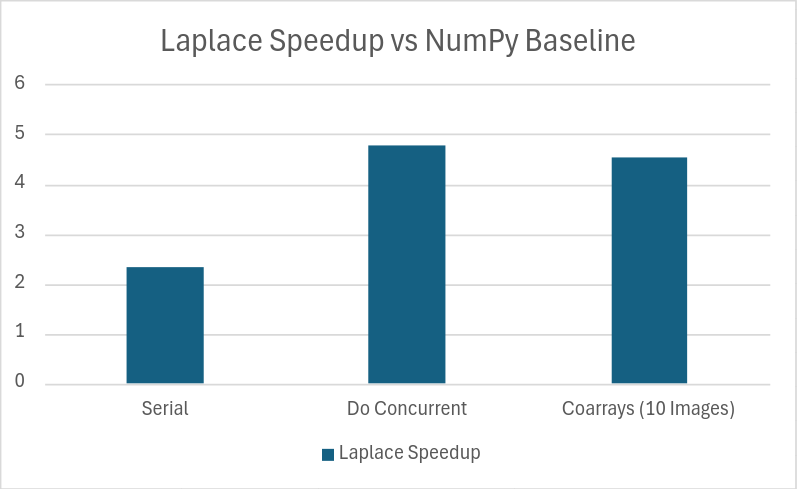
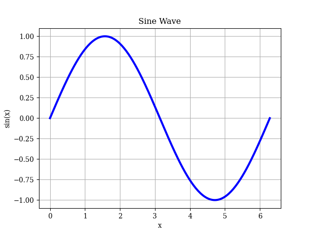

# FortScript Transpiler

A transpiler from FortScript (a Python-like numerical computing language) to modern parallel Fortran, written in OCaml using Menhir and ocamllex.

**Goals**:
- Use Python<sup>1</sup> to generate parallel, scalable, readable, high-performance scaffolding for Fortran programs, and
- Provide a fast numerical computing language in its own right for those uninterested in Fortran. 

**Parallelism**:
- Loop-level with [`do concurrent`](https://www.intel.com/content/www/us/en/docs/fortran-compiler/developer-guide-reference/2025-3/do-concurrent.html)
- SPMD (MPI-style) with [coarrays](https://www.intel.com/content/www/us/en/docs/fortran-compiler/developer-guide-reference/2025-3/coarrays-001.html)

**Inspired in part by**:
- the [mojo](modular.com/open-source/mojo) language
- the [transpyle](https://github.com/mbdevpl/transpyle) project
- the [pyccel](https://github.com/pyccel/pyccel) project
- the [pythran](https://pythran.readthedocs.io/en/latest/) project

See the [examples/](./examples) directory for FortScript examples to refer to (or to point LLMs to...) when writing programs.

<sup>1</sup> _FortScript isn't quite Python, but is close and has a small learning curve for HPC developers familiar with Python._

## Benchmarks

See [build-benchmarks.sh](./build-benchmarks.sh). CPU-only benchmarks performed on M3 Ultra.

### Molecular Dynamics Benchmark

Molecular dynamics benchmark adapted from [pyccel-benchmarks](https://github.com/pyccel/pyccel-benchmarks/tree/main):



`benchmarks/md.py` stays close to the original loop-heavy version, while
`benchmarks/md_numpy.py` uses NumPy broadcasting and whole-array operations
for a more idiomatic Python comparison point. Number of particles increased to 10x of original `pyccel` benchmark to make the problem size large enough for parallelism.

### 2D Laplace Benchmark

2D Laplace (Jacobi iteration) benchmark also adapted from [pyccel-benchmarks](https://github.com/pyccel/pyccel-benchmarks/tree/main):



Matrix size increased to ~1100x of original `pyccel` benchmark to make the problem size large enough for parallelism. Note that the original code utilizes NumPy idomatically (unlike with the MD benchmark). The serial FortScript code is ~2x faster than the NumPy baseline while using ~75% less memory.

## Features

- Simple, strongly typed Python-like syntax
- Fortran parallelism: `do concurrent` for loops and coarrays for MPI-style programming
- Imperative programming style:
    - Structs (nested allowed, also 1D arrays of structs allowed)
    - No recursion allowed (enforced by the compiler)
- NumPy-inspired array syntax:
    - array operations mapped to Fortran intrinsics
    - array slicing with slice assignment
    - `numpy.linalg` equivalents
- Fixed-size and dynamically sized arrays
- Basic whole-file imports with once-per-file include guards
- Standard library with BLAS/LAPACK support
- Generates modern F2018-compliant Fortran
- Save-to-disk line plotting through [pyplot-fortran](https://github.com/jacobwilliams/pyplot-fortran/tree/master)

**Parallelism**:
- `@par` loop annotation generates `do concurrent` loops
    - Optional `@local(...)`, `@local_init(...)`, and `@reduce(op: vars...)` clauses lower to native Fortran 2018 `LOCAL` / `LOCAL_INIT` locality specifiers on `do concurrent`; reductions use a per-iteration array combined after the loop
    - Inner loop variables nested inside a `@par` body are automatically added to `LOCAL`
    - Transpiler marks functions inside `do concurrent` loops as `pure`
    - **Note**: Not all loops marked with `@par` will be parallelized if the compiler deems it either:
        - Impossible due to a data dependency, or
        - Not worth the overhead due to array sizing.
- Coarray SPMD support with `*` type annotations, `{img}` remote access, `sync`, `allocate`
    - F2018 collective operations (`co_sum`, `co_min`, `co_max`, `co_broadcast`, `co_reduce`)
    - Combining `@par` with coarrays is allowed; Mimics the common MPI+OpenMP setup in HPC

## Quick Start

**Prereqs (macOS)**

First install [homebrew](https://brew.sh/). Then execute the following commands:

```
brew install opam gfortran python3 python-matplotlib opencoarrays
opam install menhir dune
```

**Prereqs (Linux)**

First install `conda`; [miniforge](https://github.com/conda-forge/miniforge) is a good choice. Then execute the following commands: 

```
conda env create -f linux-environment.yml
conda activate fortscript
cd
git clone https://github.com/sourceryinstitute/OpenCoarrays.git
mkdir build-opencoarrays && cd build-opencoarrays
cmake -DBUILD_TYPE=Release -DCMAKE_INSTALL_PREFIX=$CONDA_PREFIX ../OpenCoarrays
make -j8
make test
make install
```

**Build `pyplot-fortran`**

```
cd
git clone https://github.com/jacobwilliams/pyplot-fortran.git
cd pyplot-fortran
fpm build --profile release
```

**Run a FortScript application:**

First, edit the `PYPL*` variables in [env-setup.sh](./env-setup.sh) to match the pyplot paths on your system.

Then:

```
source env-setup.sh
dune exec bin/main.exe -- examples/heat_diffusion.py -o heat_diffusion.f90
gfortran $(echo $PFFLAGS) -o heat_diffusion heat_diffusion.f90
./heat_diffusion
```

**Build all examples:**
- `./build-examples.sh` (macOS)
- `bash build-examples.sh` (Linux)

**Build all benchmarks:**
- `./build-benchmarks.sh` (macOS)
- `bash build-benchmarks.sh` (Linux)

`gfortran` 15.2 with the main OpenCoarrays branch on macOS arm64 & Ubuntu x86_64 have been tested, with the primary development ocurring on macOS.

## Example

```python
struct Particle:
    x: float
    y: float
    mass: float

def step(n: int, 
         vx: array[float], 
         vy: array[float],
         particles: array[Particle], 
         dt: float
    ):
    @par # Parallel loop!
    for i in range(n):
        particles[i].x += vx[i]*dt
        particles[i].y += vy[i]*dt
```

## Language Reference

See [LANGUAGE.md](LANGUAGE.md) for the full language reference (types, builtins, array access, imports, operators, plotting, and standard library).

## Parallelism: Parallel Loops

*examples/parallel_bench.py* is an example of a program that `gfortran` deems 'worth it' to parallelize.

Compile with:
- `dune exec bin/main.exe -- examples/parallel_bench.py -o parallel_bench.f90`
- `gfortran $(echo $PFFLAGS) -o parallel_bench parallel_bench.f90`

Observe the output from the `-ftree-parallelize-loops` & `-fopt-info-loop` flags:


>parallel_bench.f90:14:85: optimized: **parallelizing** inner loop 5

>parallel_bench.f90:46:107: optimized: **parallelizing** inner loop 1

>parallel_bench.f90:14:85: optimized: **parallelizing** inner loop 1

This tells us that the loop we marked with @par is parallelized successfully (line 14 in the generated code):
```python
@par
for i in range(n):
    y[i] = exp(-x[i] * x[i]) * cos(x[i] * 3.14159265358979)
```
```fortran
do concurrent (i = 0:n - 1)
    y(i + 1) = (exp(((-x(i + 1)) * x(i + 1))) * cos((x(i + 1) * 3.14159265358979)))
end do
```

But we also see another loop mentioned, at line 46. `gfortran` was able to parallelize `linspace` as well:
```python
x: array[float] = linspace(-5.0, 5.0, n)
```
```fortran
x = [(((-5.0d0) + (5.0d0 - (-5.0d0)) * dble(fortscript_i__) / dble(n - 1)), fortscript_i__ = 0, n - 1)]
```

FortScript also supports `do concurrent` clauses through stacked annotations above an `@par` loop:

```python
@par
@local(tmp)
@local_init(seed)
@reduce(add: total)
@reduce(max: peak)
for i in range(n):
    ...
```

which lowers to native Fortran 2018 `LOCAL` / `LOCAL_INIT` locality specifiers on `do concurrent`, with array-based reduction scaffolding after the loop. Inner loop variables nested inside the `@par` body are automatically added to `LOCAL`.

`@local(...)` and `@local_init(...)` currently support scalar variables. See *examples/do_concurrent_features.py* for a complete example.

## Parallelism: Coarrays

FortScript now has a small coarray surface for SPMD programs:

```python
def main():
    me: int = this_image()
    shared: float* = 0.0

    if me == 0:
        shared = 42.0

    sync
    print(shared{0})
```

Key rules:
- Deferred-shape coarrays must be allocated explicitly with `allocate(...)`.
- The compiler automatically inserts a final `sync all` at the end of `main()`.
- Current restrictions: no coarray struct fields, no coarray parameters, no coarray return types, and no coarray operations inside `@par` loops.

See *examples/coarray_multiple_codims.py* for a 2D block-decomposed heat-diffusion example using a 2-codimension coarray image grid and `@par` for the local stencil sweep. The example snapshots the coarray tile into a plain local array, then runs a column-by-column stencil with an inner `@par` sweep over the contiguous dimension so the generated `do concurrent` kernel reads local data and writes each output cell exactly once.

### Collective operations

Coarray collectives operate in-place on coarray variables across all images:

```python
val: float* = 0.0
val = 1.0 * (me + 1)
sync
co_sum(val)        # Every image now sees the global sum.
co_min(val)        # Global minimum.
co_max(val)        # Global maximum.
co_broadcast(val, 0)  # Broadcast from image 0 to all.
co_reduce(val, my_add) # User-defined reduction (function must be pure).
```

Caveats:
- Collective operations are **statement-only** -- they cannot be used in expressions.
- The argument must be a coarray variable (scalar or array). Array arguments are reduced element-wise.
- `co_broadcast` takes a 0-based source image index, which is converted to Fortran's 1-based indexing automatically.
- The operation function passed to `co_reduce` must be **pure** (no side effects, no I/O). The transpiler marks it as `pure` automatically.

See *examples/coarray_collective_operations.py* for more details.

### Compiling coarray programs

Compile coarray programs with OpenCoarrays:

```
dune exec bin/main.exe -- examples/coarray_hello.py -o coarray_hello.f90
caf $(echo $FFLAGS) -o coarray_hello coarray_hello.f90
cafrun -np 4 ./coarray_hello
```

## Future Work

- More `do concurrent` control
    - `shared(...)`
    - `default(none)`
    - Native `REDUCE` clause once gfortran parallelizes it (currently uses array-based workaround)
- Expand coarray support
    - Coarray parameters and return values?
    - Teams?
- New `float32` type
- Expand plotting
    - Histograms
    - Scatterplots
- Expand numerical routines written in FortScript in the support library
    - Sparse linear algebra library?
    - More optimization routines
- Expand LAPACK/BLAS wrappers closely matching `numpy.linalg`
- CUDA
    - Support for nvidia acceleration (refer to https://github.com/ianfr/economic-simulation)
    - Generate do concurrent stubs compuled separately by nvfortran and linked to with gfortran, compatiable with coarrays too

## Plotting Setup

If a FortScript program uses `plot(...)`, the generated Fortran depends on `pyplot-fortran` and must be compiled with the `pyplot_module` module file and the compiled object or archive from your local `~/pyplot-fortran/build/...` tree.

The runtime side of `pyplot-fortran` launches `python3`, so `matplotlib` must also be available in that interpreter.

It is necessary to add the location of the pyplot .mod file to the gfortran include path (`-I`), and the location of libpyplot-fortran.a to the linker path (`-L`) as well as link (`-l`) against it. Here is an example of that:

`gfortran -O2 -std=f2018 -I/Users/ian/pyplot-fortran/build/gfortran_C3CACAC4D0122D28 -o plotting plotting.f90 -L/Users/ian/pyplot-fortran/build/gfortran_24C83E9D044ED2EE/pyplot-fortran -lpyplot-fortran`

**Note** that using the environment variables specified in env-setup.sh takes care of this for you.



