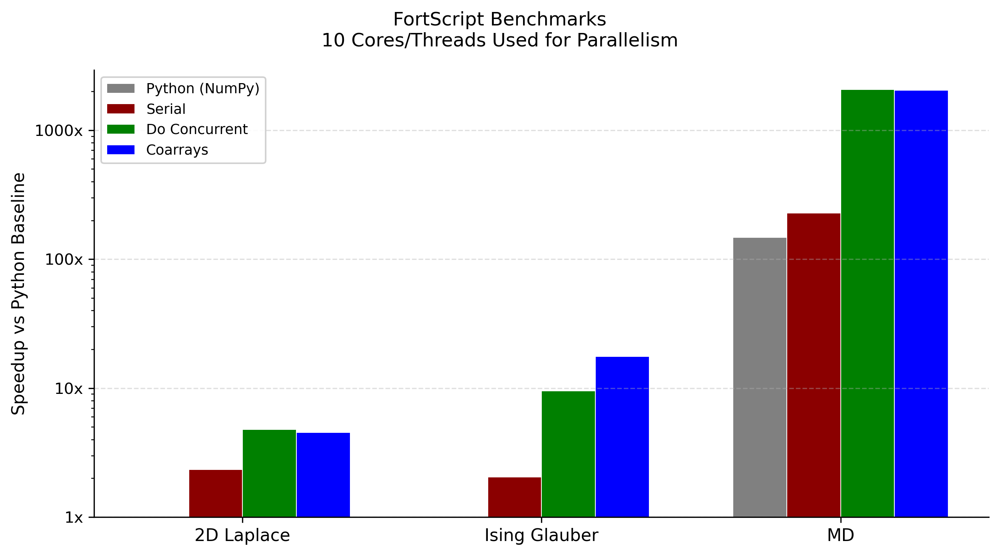
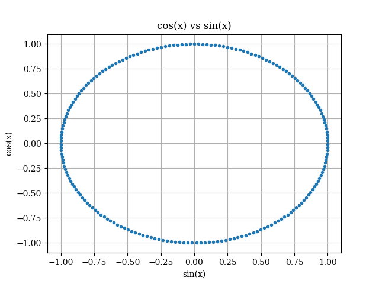
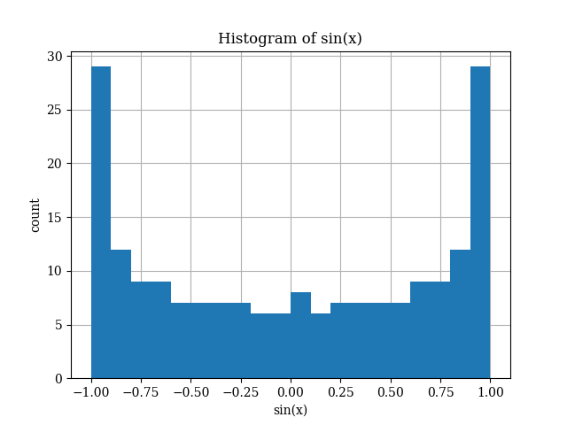
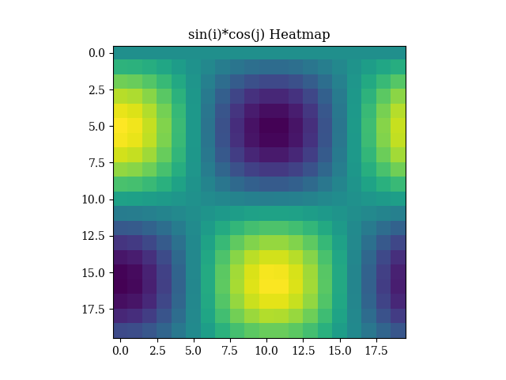
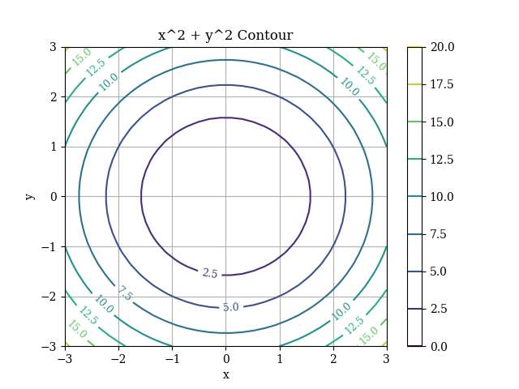
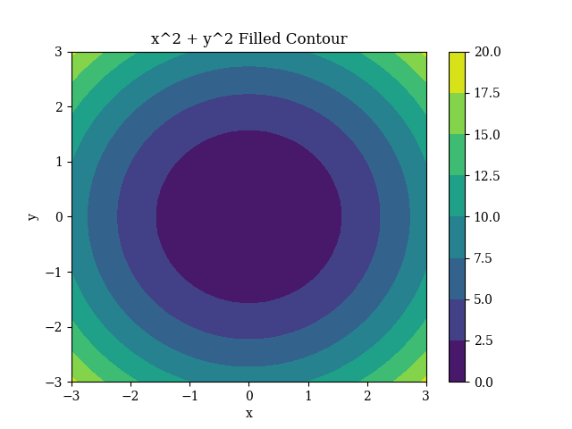

# FortScript Transpiler

A transpiler from FortScript (a Python-like numerical computing language) to modern parallel Fortran, written in [OCaml](https://ocaml.org/) using [Menhir](https://gitlab.inria.fr/fpottier/menhir) and [ocamllex](https://ocaml.org/manual/5.4/lexyacc.html).

**Goals**:
- Use a Python-like language to generate parallel, scalable, readable, high-performance scaffolding for Fortran programs, and
- Provide a fast numerical computing language in its own right for those uninterested in Fortran. 

**Parallelism**:
- Loop-level with [`do concurrent`](https://www.intel.com/content/www/us/en/docs/fortran-compiler/developer-guide-reference/2025-3/do-concurrent.html)
- SPMD (MPI-style) with [coarrays](https://www.intel.com/content/www/us/en/docs/fortran-compiler/developer-guide-reference/2025-3/coarrays-001.html)

**Inspired in part by**:
- the [mojo](modular.com/open-source/mojo) language
- the [transpyle](https://github.com/mbdevpl/transpyle) project
- the [pyccel](https://github.com/pyccel/pyccel) project
- the [pythran](https://pythran.readthedocs.io/en/latest/) project

See the [examples/](./examples) directory for FortScript examples to refer to (or to point LLMs to...) when writing programs.

See [LANGUAGE.md](./LANGUAGE.md) for more details about the FortScript language itself.

See [DETAILS.md](./DETAILS.md) for more info about how the transpiler works.

## Benchmarks

See [build-benchmarks.sh](./build-benchmarks.sh). CPU-only benchmarks performed on M3 Ultra.



### 2D Laplace Benchmark

2D Laplace (Jacobi iteration) benchmark also adapted from [pyccel-benchmarks](https://github.com/pyccel/pyccel-benchmarks/tree/main):

Number of matrix elements increased to ~1100x the original `pyccel` benchmark to make the problem size large enough for parallelism. Note that the original code _does_ utilize NumPy idomatically (_unlike_ with the MD benchmark). The serial FortScript code is ~2x faster than the NumPy baseline while using ~75% less memory.

### 3D Ising Glauber Benchmark

3D Ising model with heat-bath (Glauber) dynamics with ~16 million grid points. The coarray benchmark decomposes the lattice into z-slabs with ghost-plane exchange between neighboring images.

Based on Herrmann & Bottcher, Computational Statistical Physics, 2021. See references in [benchmarks/ising_glauber.py](benchmarks/ising_glauber.py) for more details.

### Molecular Dynamics Benchmark

Molecular dynamics benchmark adapted from [pyccel-benchmarks](https://github.com/pyccel/pyccel-benchmarks/tree/main):

[benchmarks/md.py](./benchmarks/md.py) stays close to the original loop-heavy version, while
[benchmarks/md_numpy.py](./benchmarks/md_numpy.py) uses NumPy broadcasting and whole-array operations
for a more idiomatic Python comparison point. Number of particles increased to 10x of original `pyccel` benchmark to make the problem size large enough for parallelism.

## Features

- Simple, strongly typed Python-like syntax
- Fortran parallelism: `do concurrent` for loops and coarrays for MPI-style programming
- Imperative programming style:
    - Structs (nested allowed, also 1D arrays of structs allowed)
    - No recursion allowed (enforced by the compiler)
- NumPy-inspired array syntax:
    - array operations mapped to Fortran intrinsics
    - array slicing with slice assignment
    - `numpy.linalg` equivalents
- Fixed-size and dynamically sized arrays
- Basic whole-file imports with relative paths
- Standard library with BLAS/LAPACK support
- HDF5 file I/O
- Generates modern F2018-compliant Fortran
- Save-to-disk plotting

**Parallelism**:
- `@par` loop annotation generates `do concurrent` loops
    - Optional `@local(...)`, `@local_init(...)`, and `@reduce(op: vars...)` clauses lower to native Fortran 2018 `LOCAL` / `LOCAL_INIT` locality specifiers on `do concurrent`; reductions use a per-iteration array combined after the loop
    - Inner loop variables nested inside a `@par` body are automatically added to `LOCAL`
    - Transpiler marks functions inside `do concurrent` loops as `pure`
    - `@gpu` on top of `@par` extracts the loop to a separate `_gpu.f90` kernel for Linux `nvfortran` builds
    - **Note**: Not all loops marked with `@par` will be parallelized if the compiler deems it either:
        - Impossible due to a data dependency, or
        - Not worth the overhead due to array sizing.
- Coarray SPMD support with `*` type annotations, `{img}` remote access, `sync`, `allocate`
    - F2018 collective operations (`co_sum`, `co_min`, `co_max`, `co_broadcast`, `co_reduce`)
    - Combining `@par` with coarrays is allowed; Mimics the common MPI+OpenMP setup in HPC

## Quick Start

**Prerequisites**

Make sure a package manager is available on your system:
- macOS: [homebrew](https://brew.sh/)
- Linux: conda ([miniforge](https://github.com/conda-forge/miniforge) is a good choice)

Then execute the following command, which will install all of the dependencies for you:
- macOS: `zsh dependencies.sh`
- Linux: `bash dependencies.sh`

There may be slight differences in Linux environments that have not been tested; if you run into path-related issues use [dependencies.sh](./dependencies.sh) as a reference.

**Run a FortScript example application:**

```bash
source env-setup.sh

 _build/default/bin/main.exe examples/heat_diffusion.py -o heat_diffusion.f90

gfortran $(echo $PFFLAGS) -o heat_diffusion heat_diffusion.f90

./heat_diffusion
```

**Build all examples:**
- `./build-examples.sh` (macOS)
- `bash build-examples.sh` (Linux)

**Build all benchmarks:**
- `./build-benchmarks.sh` (macOS)
- `bash build-benchmarks.sh` (Linux)

`gfortran` 15.2 with the main OpenCoarrays branch on macOS arm64 & Ubuntu x86_64 have been tested, with the primary development ocurring on macOS.

## Example

```python
struct Particle:
    x: float
    y: float
    mass: float

def step(n: int, 
         vx: array[float], 
         vy: array[float],
         particles: array[Particle], 
         dt: float
    ):
    @par # Parallel loop!
    for i in range(n):
        particles[i].x += vx[i]*dt
        particles[i].y += vy[i]*dt
```

## Language Reference

See [LANGUAGE.md](LANGUAGE.md) for the full language reference (types, builtins, array access, imports, operators, plotting, and standard library).

## Parallelism: Parallel Loops

[`examples/parallel_bench.py`](./examples/parallel_bench.py) is an example of a program that `gfortran` deems 'worth it' to parallelize.

Compile with:
- ` _build/default/bin/main.exe examples/parallel_bench.py -o parallel_bench.f90`
- `gfortran $(echo $PFFLAGS) -o parallel_bench parallel_bench.f90`

Observe the output from the `-ftree-parallelize-loops` & `-fopt-info-loop` flags:


>parallel_bench.f90:14:85: optimized: **parallelizing** inner loop 5

>parallel_bench.f90:46:107: optimized: **parallelizing** inner loop 1

>parallel_bench.f90:14:85: optimized: **parallelizing** inner loop 1

This tells us that the loop we marked with @par is parallelized successfully (line 14 in the generated code):
```python
@par
for i in range(n):
    y[i] = exp(-x[i] * x[i]) * cos(x[i] * 3.14159265358979)
```
```fortran
do concurrent (i = 0:n - 1)
    y(i + 1) = (exp(((-x(i + 1)) * x(i + 1))) * cos((x(i + 1) * 3.14159265358979)))
end do
```

But we also see another loop mentioned, at line 46. `gfortran` was able to parallelize `linspace` as well:
```python
x: array[float] = linspace(-5.0, 5.0, n)
```
```fortran
x = [(((-5.0d0) + (5.0d0 - (-5.0d0)) * dble(fortscript_i__) / dble(n - 1)), fortscript_i__ = 0, n - 1)]
```

FortScript also supports `do concurrent` clauses through stacked annotations above an `@par` loop:

```python
@par
@local(tmp)
@local_init(seed)
@reduce(add: total)
@reduce(max: peak)
for i in range(n):
    ...
```

which lowers to native Fortran 2018 `LOCAL` / `LOCAL_INIT` locality specifiers on `do concurrent`, with array-based reduction scaffolding after the loop. Inner loop variables nested inside the `@par` body are automatically added to `LOCAL`.

`@local(...)` and `@local_init(...)` currently support scalar variables. See [examples/do_concurrent_features.py](./examples/do_concurrent_features.py) for a complete example.

## Parallelism: GPU Acceleration (Experimental)

FortScript has experimental support for offloading `@par` loops into separate Fortran kernels for `nvfortran` using the `@gpu` decorator:

```python
@par
@gpu
for i in range(n):
    y[i] = gaussian_rbf(x[i])
```

Build:
- `fs_build_gpu examples/gpu_rbf_kernel.py`
- `./out/gpu_rbf_kernel`

Current restrictions (on top of the CPU `@par` ones):
- Linux only
- array references inside `@gpu` loops are limited to rank-1 and rank-2 arrays

See [examples/gpu_rbf_kernel.py](./examples/gpu_rbf_kernel.py) and [env-setup.sh](./env-setup.sh).

## Parallelism: Coarrays

FortScript has support for MPI-style programming (Single Program Multiple Data, SPMD) that transpiles to Fortran coarrays:

```python
def main():
    me: int = this_image()
    shared: float* = 0.0

    if me == 0:
        shared = 42.0

    sync
    print(shared{0})
```

Notes:
- Deferred-shape coarrays must be allocated explicitly with `allocate(...)`.
- The compiler automatically inserts a final `sync all` at the end of `main()`.

Restrictions (most of which are from Fortran): 
- No coarray struct fields
- No coarray parameters
- No coarray return types
- No coarray operations inside `@par` loops

See [examples/coarray_multiple_codims.py](./examples/coarray_multiple_codims.py) for a 2D block-decomposed heat-diffusion example using a 2-codimension coarray image grid and `@par` for the local stencil sweep. The example snapshots the coarray tile into a plain local array, then runs a column-by-column stencil with an inner `@par` sweep over the contiguous dimension so the generated `do concurrent` kernel reads local data and writes each output cell exactly once.

### Collective operations

Coarray collectives operate in-place on coarray variables across all images:

```python
val: float* = 0.0
val = 1.0 * (me + 1)
sync
co_sum(val)        # Every image now sees the global sum.
co_min(val)        # Global minimum.
co_max(val)        # Global maximum.
co_broadcast(val, 0)  # Broadcast from image 0 to all.
co_reduce(val, my_add) # User-defined reduction (function must be pure).
```

Notes:
- Collective operations are statement-only (cannot be used in expressions).
- The argument must be a coarray variable (scalar or array). Array arguments are reduced element-wise.
- `co_broadcast` takes a 0-based source image index
- The operation function passed to `co_reduce` must be pure

See [examples/coarray_collective_operations.py](./examples/coarray_collective_operations.py) for more details.

### Compiling & running coarray programs

Transpilation is the same as always:
- `_build/default/bin/main.exe examples/coarray_hello.py -o coarray_hello.f90`

And compilation is the same too, except `caf` is used instead of `gfortran`:
- `caf $(echo $FFLAGS) -o coarray_hello coarray_hello.f90`

To run, instead of executing directly use `cafrun` to set the number of parallel images:
- `cafrun -np 4 ./coarray_hello`

## HDF5 I/O

`h5write` and `h5read` are statement-only builtins that lower to the
[h5fortran](https://github.com/geospace-code/h5fortran) high-level interface.
Each call opens the target file, writes/reads the named dataset, and closes
the file again, so multiple datasets can live in the same `.h5` file by reusing
the filename:

```python
h5write("data.h5", "/pi", 3.14159)            # scalar
h5write("data.h5", "/x1d", linspace(0.0, 1.0, 5))  # 1D array

y2d: array[float, :, :]
allocate(y2d, 2, 3)                            # h5read needs storage to exist
h5read("data.h5", "/x2d", y2d)
```

Both builtins work for scalars and 1D-7D arrays of `int`/`float` (and the
other types h5fortran supports). For arrays, `h5read`'s destination must
already be allocated to the on-disk shape. See [examples/hdf5_io.py](./examples/hdf5_io.py) for a
round-trip demo covering scalars and 1D/2D/3D arrays in a single file.

## Future Work

- Test on ethernet MPI cluster (Linux arm64)
- Pull compilation commands into shell functions in [env-setup.sh](./env-setup.sh)
- True RNG support (including parallel)
- HDF5 struct import/export 
- More `do concurrent` control
    - `shared(...)`
    - `default(none)`
    - Native `REDUCE` clause once gfortran parallelizes it (currently uses array-based workaround)
- Expand coarray support
    - Coarray parameters and return values?
    - Teams?
- New `float32` type
- Expand numerical routines written in FortScript in the support library
    - Sparse linear algebra library?
    - More optimization routines
- Expand LAPACK/BLAS wrappers closely matching `numpy.linalg`
- GPU follow-up:
    - Test more kernels beyond the current elementwise example set
    - Explore coarray + GPU interoperability more thoroughly (Test calling GPU `do concurrent` loops from coarray program (2 images))
    - Improve Linux/NVHPC environment detection and diagnostics

## Plotting

Using the included [dependencies.sh](./dependencies.sh) and [env-setup.sh](./env-setup.sh) takes care of setup and linking to pyplot-fortran with the `$FFLAGS`/`$PFFLAGS` and `$FLIBS` environment variables.








## Acknowledgements
Source code archives from the following projects (including their original licenses) are included in the _depends/_ folder:
- https://github.com/sourceryinstitute/OpenCoarrays
- https://github.com/jacobwilliams/pyplot-fortran
- https://github.com/geospace-code/h5fortran
